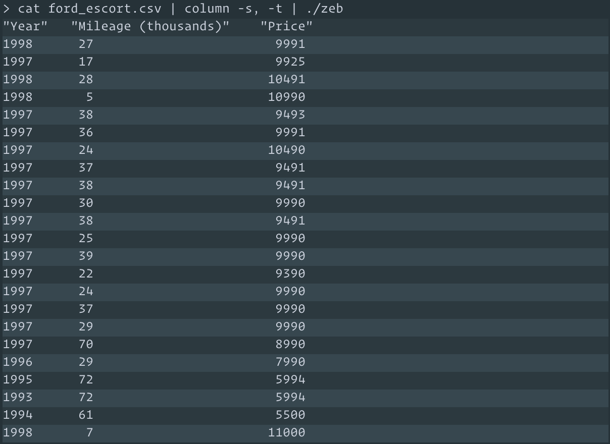

# zeb

The `zeb` command-line utility writes its input with alternating colors, or
*"zebra striping"*. This is especially useful when working with tabular data,
such as CSV, TSV, and sqlite but can be used with any textual input.

